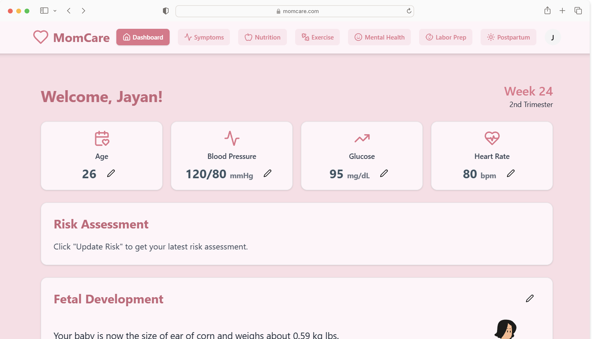

# MomCare - Maternal Healthcare Assistant

An intelligent maternal healthcare assistant for expecting mothers, offering personalized tracking, guidance, and support throughout pregnancy and postpartum.



## Features

- **Personalized Dashboard**: Get a quick overview of your health metrics and upcoming reminders.
- **Symptom Tracker**: Log and monitor your symptoms, with suggestions to manage them.
- **Nutrition Guide**: Receive personalized meal plans and nutritional advice.
- **Exercise Tracker**: Follow recommended exercises tailored to your pregnancy stage.
- **Mental Health Support**: Access tools like a depression screening quiz and a weekly mood tracker.
- **Labor Preparation**: Get ready for labor with a comprehensive checklist and resources.
- **Maternal Health Chatbot**: Get instant answers to your maternal health questions from our AI-powered chatbot.
- **Postpartum Care**: Continue to receive support and guidance after giving birth.

## Tech Stack

- **Framework**: [Next.js](https://nextjs.org/)
- **Language**: [TypeScript](https://www.typescriptlang.org/)
- **Styling**: [Tailwind CSS](https://tailwindcss.com/)
- **ORM**: [Prisma](https://www.prisma.io/)
- **Authentication**: [NextAuth.js](https://next-auth.js.org/)
- **Database**: PostgreSQL (or your chosen database with Prisma)
- **UI Components**: [Shadcn UI](https://ui.shadcn.com/), [Recharts](https://recharts.org/) for charts.

## Getting Started

Follow these instructions to set up and run the project locally.

### Prerequisites

- [Node.js](https://nodejs.org/en/) (version 20.x or higher)
- [npm](https://www.npmjs.com/) or [yarn](https://yarnpkg.com/)
- A running PostgreSQL instance (or other database compatible with Prisma).

### Installation & Setup

1.  **Clone the repository:**
    ```bash
    git clone https://github.com/your-username/mom_care.git
    cd mom_care
    ```

2.  **Install dependencies:**
    ```bash
    npm install
    ```

3.  **Set up environment variables:**
    Create a `.env` file in the root of the project and add the following variables. See `.env.example` for a template.
    ```env
    DATABASE_URL="your_database_connection_string"
    NEXTAUTH_URL="http://localhost:3000"
    NEXTAUTH_SECRET="your_nextauth_secret"
    # Add other environment variables if any (e.g., for APIs)
    ```

4.  **Apply database migrations:**
    ```bash
    npx prisma migrate dev
    ```

5.  **Run the development server:**
    ```bash
    npm run dev
    ```

The application should now be running at [http://localhost:3000](http://localhost:3000).
